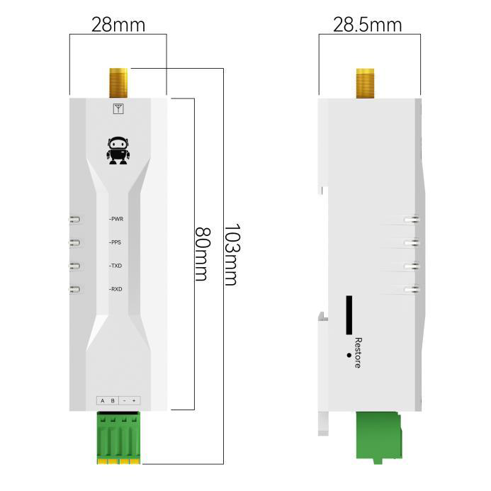
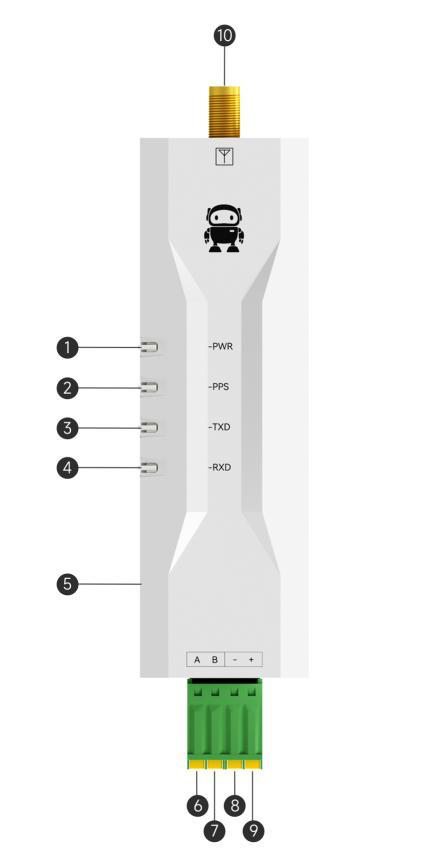
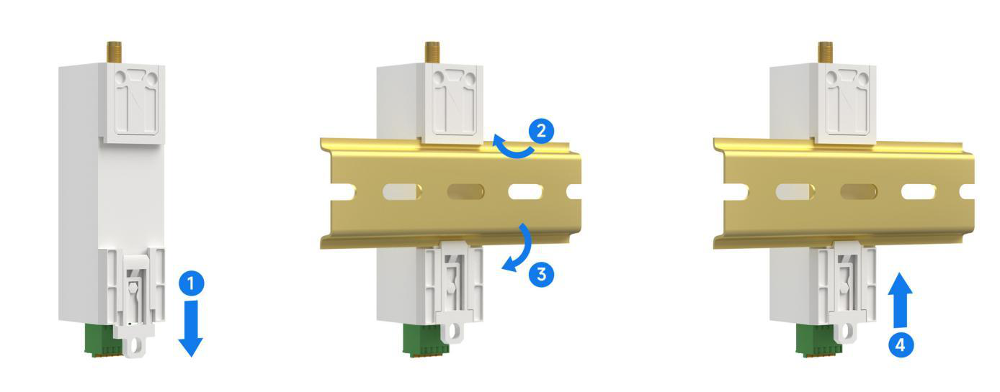
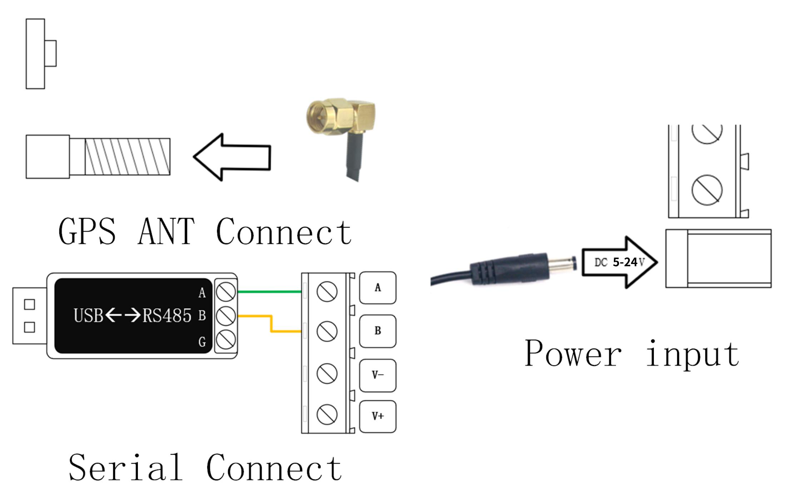

# EWD108-GN0x Series User Manual

> Clean Markdown documentation converted from the EBYTE EWD108-GN0x Series User Manual.
>
> Models covered: EWD108-GN03, EWD108-GN03B, EWD108-GN04, EWD108-GN05, EWD108-GN06B.

## Contents

- [Overview](#overview)
- [Features](#features)
- [Applications](#applications)
- [Technical specifications](#technical-specifications)
- [Mechanical dimensions](#mechanical-dimensions)
- [Pins and indicators](#pins-and-indicators)
- [Installation](#installation)
- [Modbus protocol](#modbus-protocol)
- [Register map](#register-map)
- [Satellite system selection values](#satellite-system-selection-values)
- [Quick start](#quick-start)
- [Modbus RTU examples](#modbus-rtu-examples)
- [Revision history](#revision-history)
- [Contact](#contact)

## Overview

The EWD108-GN0x series is a GNSS positioning terminal that supports multiple positioning standards, including GPS, BDS, GLONASS, Galileo, QZSS, and SBAS depending on the model.

The device outputs positioning information through Modbus RTU. It supports:

- RMC ASCII strings following the NMEA 0183 protocol.
- Individual Modbus registers for position, time, longitude, latitude, speed, course, antenna setting, satellite system, and update frequency.
- RS485, RS232, or TTL/UART interface variants.
- Configurable serial baud rates up to 115200 bps.

## Features

- Supports BDS/GPS/GLONASS/Galileo/QZSS/SBAS satellite navigation systems depending on model.
- Supports multi-system combined positioning.
- Positioning accuracy:
  - EWD108-GN03: up to 2.5 m CEP50.
  - EWD108-GN03B: up to 2.5 m horizontal / 3.0 m vertical.
  - EWD108-GN04: up to 1.5 m CEP50.
  - EWD108-GN05: up to 1.0 m CEP50.
  - EWD108-GN06B: up to 1.0 m CEP50.
- Configurable baud rates from 1200 to 115200 bps.
- Standard Modbus RTU protocol.
- Active/passive antenna switching.
- Antenna positioning status through registers and indicators.
- TVS protection on the communication interface.
- 5-24 V DC input.
- DIN rail and mounting-hole installation.
- Industrial operating temperature range: -40 to +85 deg C.

## Applications

- Vehicle positioning and navigation equipment.
- Industrial GNSS positioning or navigation.
- Asset tracking.

## Technical specifications

### General specifications

| Parameter | EWD108-GN03 | EWD108-GN03B | EWD108-GN04 | EWD108-GN05 | EWD108-GN06B |
|---|---:|---:|---:|---:|---:|
| Supply voltage | 5-24 V DC | 5-24 V DC | 5-24 V DC | 5-24 V DC | 5-24 V DC |
| Communication interface | RS485 / RS232 / UART | RS485 / RS232 / UART | RS485 / RS232 / UART | RS485 / RS232 / UART | RS485 / RS232 / UART |
| Baud rate range | 1200-115200 bps | 1200-115200 bps | 1200-115200 bps | 1200-115200 bps | 1200-115200 bps |
| Protocol | Modbus RTU | Modbus RTU | Modbus RTU | Modbus RTU | Modbus RTU |
| Supported positioning systems | BDS / GPS / GLONASS | BDS | BDS / GPS / GLONASS / Galileo | BDS / GPS / GLONASS / Galileo / QZSS / SBAS | BDS |
| Positioning update rate | 1-10 Hz | 1-10 Hz | 1-10 Hz | 1 Hz or 10 Hz | 1-10 Hz |
| User configuration | Modify registers via Modbus RTU; reboot to take effect | Same | Same | Same | Same |
| Antenna interface | SMA | SMA | SMA | SMA | SMA |
| Hardware interface | 4-pin 3.81 mm Phoenix terminal | Same | Same | Same | Same |
| Size | 103 x 28 x 28.5 mm | Same | Same | Same | Same |
| Weight | 32 +/- 5 g | Same | Same | Same | Same |
| Operating temperature | -40 to +85 deg C | Same | Same | Same | Same |
| Operating humidity | 10-90% RH, non-condensing | Same | Same | Same | Same |
| Storage temperature | -55 to +100 deg C | Same | Same | Same | Same |

Interface suffixes:

| Model suffix | Interface |
|---|---|
| `(485)` | RS485 |
| `(232)` | RS232 |
| `(TTL)` | UART |

### Operating frequencies

| Model | Operating frequency support |
|---|---|
| EWD108-GN03 | BDS B1, GPS L1, GLONASS L1 |
| EWD108-GN03B | BDS B1C, B1I |
| EWD108-GN04 | GPS L1 C/A, QZSS L1 C/A/S, GLONASS L1OF, BDS B1I/B1C, Galileo E1B/C, SBAS L1 C/A |
| EWD108-GN05 | GPS/QZSS L1 C/A, L1C, L2C, L5, L6; BDS B1C, B1I, B2a, B2I, B3I; GLONASS L1/L2; Galileo E1/E5/E6; SBAS WAAS/EGNOS/MSAS/GAGAN/SDCM |
| EWD108-GN06B | BDS B1I, B1C, B2I, B3I, B2a, B2b |

### GNSS performance

| Type | Parameter | EWD108-GN03 | EWD108-GN03B | EWD108-GN04 | EWD108-GN05 | EWD108-GN06B | Unit |
|---|---|---:|---:|---:|---:|---:|---|
| Positioning time | Cold start | 32 | 23 | 28 | 27.5 | 23 | s |
| Positioning time | Warm start | 1 | 1 | 1 | 1 | 1 | s |
| Positioning time | Recapture | 1 | 1 | 1 | 1 | 1 | s |
| Sensitivity | Cold start | -148 | -148 | -148 | -148 | -148 | dBm |
| Sensitivity | Warm start | -156 | -156 | -159 | -162 | -156 | dBm |
| Sensitivity | Recapture | -160 | -160 | -160 | -164 | -160 | dBm |
| Sensitivity | Tracking | -162 | -162 | -167 | -166 | -162 | dBm |
| Accuracy | Horizontal positioning | 2.5 | 2.5 horizontal / 3.0 vertical | 1.5 | 1.0 | 1.0 | m |
| Accuracy | Speed positioning | 0.1 | 0.1 | 0.05 | 0.1 | 0.05 | m/s |
| Accuracy | Timing | 30 | 30 | 30 RMS / 60 99% | 30 | 10 | ns |
| Power consumption | Capture current | 15 | 20 | 10 | 20 | 20 | mA |
| Power consumption | Tracking current | 15 | 20 | 10 | 20 | 20 | mA |

Test conditions from the manual:

1. More than 6 received satellites, all satellite signal strengths at -130 dBm, 10 tests averaged, positioning error less than 10 m.
2. External LNA noise factor 0.8, more than 6 received satellites, received signal strength measured under lock or non-lock within 5 minutes.
3. Open and unobstructed environment, 24-hour continuous power-on test, 50% CEP.
4. 12 V DC power supply, more than 6 received satellites, all satellite signal strengths at -130 dBm.

## Mechanical dimensions



Main dimensions:

| Dimension | Value |
|---|---:|
| Body length | 103 mm |
| Body width | 28 mm |
| Body height | 28.5 mm |
| Mounting reference height | 80 mm |
| Back clip height | 89 mm |
| Rail clip width | 12 mm |
| Mounting hole diameter | 4.9 mm |

## Pins and indicators



| No. | Name | Function |
|---:|---|---|
| 1 | PWR indicator | Power indicator. Always on when powered. |
| 2 | PPS indicator | Seconds pulse indicator. Off when positioning is invalid; flashes once per second when positioning is valid. |
| 3 | TXD indicator | Transmit indicator. Blinks when sending data to the RS485 bus. |
| 4 | RXD indicator | Receive indicator. Blinks when receiving data from the RS485 bus. |
| 5 | Factory key | Hold for 5-10 s to restore factory communication settings. Factory settings: address `1`, serial port `9600/8/no parity/1`. |
| 6 | A/TXD | RS485 A / UART TXD / RS232 TXD. |
| 7 | B/RXD | RS485 B / UART RXD / RS232 RXD. |
| 8 | Power negative | Power ground. |
| 9 | Power positive | 5-24 V DC power input. |
| 10 | ANT | SMA antenna connector. |

## Installation

The device supports DIN rail mounting and mounting-hole installation.



## Modbus protocol

The device uses the standard Modbus RTU protocol and only uses holding registers, corresponding to Modbus register area 4.

### Register areas

| Register area | Read function | Write function | Example address | Used by this device |
|---|---:|---:|---|---|
| Discrete input | `0x02` | - | `10001` | No |
| Coil / switching output | `0x01` | `0x05`, `0x0F` | `00001` | No |
| Input register | `0x04` | - | `30001` | No |
| Holding register | `0x03` | `0x06`, `0x10` | `40001` | Yes |

### Modbus RTU request frame

```text
[Device address] [Function code] [Register start address] [Register count/value] [CRC low] [CRC high]
```

Example request shown in the manual:

```text
01 03 00 00 00 01 84 0A
```

| Field | Bytes | Meaning |
|---|---|---|
| Device address | `01` | Device address 1. |
| Function code | `03` | Read holding register. |
| Register start address | `00 00` | Starting register address. |
| Number of registers | `00 01` | Read one register. |
| CRC | `84 0A` | Modbus CRC. |

## Register map

Decimal register addresses are shown in the `40001` style used by Modbus documentation. Hex addresses are the zero-based Modbus addresses used in RTU frames.

| Function | Decimal address | Hex address | Data format | Access | Description |
|---|---:|---:|---|---|---|
| Reserved | 40001 | `0x0001` | Int16 | R | Invalid/reserved data. |
| Device address | 40002 | `0x0002` | Int16 | R/W | `1-255`, default `1`. Broadcast address `0x00` can be used for reading/modification when only one device is on the bus. |
| Baud rate | 40003 | `0x0003` | Int16 | R/W | Baud-rate code. See [Baud-rate codes](#baud-rate-codes). |
| Parity | 40004 | `0x0004` | Int16 | R/W | Parity code. See [Parity codes](#parity-codes). |
| RMC positioning data | 40005 | `0x0005` | String, 70 bytes | R | RMC NMEA 0183 data encoded as ASCII. Decoding order: AB. |
| Position state | 40200 | `0x00C8` | Int16 | R | `0` = invalid, `1` = valid. |
| Year | 40201 | `0x00C9` | Int16 | R | Example: `2022` means year 2022. |
| Month | 40202 | `0x00CA` | Int16 | R | `1-12`. |
| Day | 40203 | `0x00CB` | Int16 | R | `1-31`. |
| Hour | 40204 | `0x00CC` | Int16 | R | `0-23`, UTC. |
| Minute | 40205 | `0x00CD` | Int16 | R | `0-59`. |
| Seconds | 40206 | `0x00CE` | Int16 | R | `0-59`. |
| Longitude direction | 40207 | `0x00CF` | Int16 | R | `0x45` = `E`, `0x57` = `W`. |
| Longitude | 40208 | `0x00D0` | Float, 4 bytes | R | Degrees, 5 decimal places. IEEE 754 single-precision float, big-endian word order and byte order. |
| Latitude direction | 40210 | `0x00D2` | Int16 | R | `0x4E` = `N`, `0x53` = `S`. |
| Latitude | 40211 | `0x00D3` | Float, 4 bytes | R | Degrees, 5 decimal places. IEEE 754 single-precision float, big-endian word order and byte order. |
| Speed over ground | 40213 | `0x00D5` | Float, 4 bytes | R | Knots. IEEE 754 single-precision float, big-endian word order and byte order. |
| Course over ground | 40215 | `0x00D7` | Float, 4 bytes | R | Degrees. IEEE 754 single-precision float, big-endian word order and byte order. |
| Antenna setting | 40217 | `0x00D9` | Int16 | R/W | `0` = active antenna, `1` = passive antenna. |
| Satellite system selection | 40218 | `0x00DA` | Int16 | R/W | Supported values depend on model. See [Satellite system selection values](#satellite-system-selection-values). |
| Location update frequency | 40219 | `0x00DB` | Int16 | R/W | Frequency code. See [Update-frequency codes](#update-frequency-codes). |
| IAP upgrade flag | 40220 | `0x00DC` | Int16 | W | Write `0x0001` to enter IAP upgrade mode. Uses standard YMODEM. Readout is not supported. |
| Product model | 40221 | `0x00DD` | String, 14 bytes | R | ASCII, decoding order AB. |
| Version information | 40228 | `0x00E4` | String, 14 bytes | R | ASCII, decoding order AB. |

### Baud-rate codes

| Value | Baud rate |
|---:|---:|
| `0x0000` | 1200 bps |
| `0x0001` | 2400 bps |
| `0x0002` | 4800 bps |
| `0x0003` | 9600 bps |
| `0x0004` | 19200 bps |
| `0x0005` | 38400 bps |
| `0x0006` | 57600 bps |
| `0x0007` | 115200 bps |

### Parity codes

| Value | Parity |
|---:|---|
| `0x0000` | No parity |
| `0x0001` | Odd parity |
| `0x0002` | Even parity |

### Update-frequency codes

| Value | Frequency |
|---:|---:|
| `0x0000` | 1 Hz |
| `0x0001` | 2 Hz |
| `0x0002` | 5 Hz |
| `0x0003` | 10 Hz |

For EWD108-GN05, only these frequency codes are documented:

| Value | Frequency |
|---:|---:|
| `0x0000` | 1 Hz |
| `0x0001` | 10 Hz |

### Float format

Single-precision floating-point values use standard 32-bit IEEE 754 format. The default byte/word order is `ABCD`:

```text
High byte first, low byte second
```

Example from the manual:

```text
0x3FF1EB85 = 1.89
```

## Satellite system selection values

### EWD108-GN03

| Value | Satellite system |
|---:|---|
| `0x0000` | GPS |
| `0x0001` | BDS |
| `0x0002` | GPS + BDS (default) |
| `0x0003` | GLONASS |
| `0x0004` | GPS + GLONASS |
| `0x0005` | BDS + GLONASS |
| `0x0006` | GPS + BDS + GLONASS |

### EWD108-GN04

| Value | Satellite system |
|---:|---|
| `0x0000` | GPS L1 C/A + SBAS L1 C/A + QZSS L1 C/A/L1S |
| `0x0001` | GPS L1 C/A + SBAS L1 C/A + BeiDou B1 + QZSS L1 C/A/L1S |
| `0x0002` | GPS L1 C/A + SBAS L1 C/A + Galileo E1 + BeiDou B1 + QZSS L1 C/A/L1S (default) |
| `0x0003` | GPS L1 C/A + SBAS L1 C/A + QZSS L1 C/A/L1S + GLONASS L1 |
| `0x0004` | GPS L1 C/A + SBAS L1 C/A + Galileo E1 + QZSS L1 C/A/L1S |
| `0x0005` | GPS L1 C/A + BeiDou B1 |
| `0x0006` | GPS L1 C/A + SBAS L1 C/A + Galileo E1 + QZSS L1 C/A/L1S + GLONASS L1 |

### EWD108-GN05

| Value | Satellite system |
|---:|---|
| `0x0000` | GPS L1 + L5 |
| `0x0001` | BDS B1I + B2A |
| `0x0002` | GPS L1 + L5 + BDS B1I + B2A |
| `0x0003` | GPS L1 + L5 + GLONASS G1 |
| `0x0004` | GPS L1 + L5 + QZSS L1 + L5 |
| `0x0005` | GPS L1 + L5 + Galileo E1 + E5A |
| `0x0006` | GPS L1 + L5 + BDS B1I + B2A + GLONASS G1 + QZSS L1 + L5 + Galileo E1 + E5A + SBAS L1 (default) |

### EWD108-GN03B and EWD108-GN06B

These models support only BDS. The satellite system setting cannot be changed.

## Quick start

### Required hardware

- PC.
- EWD108-GN0x device, for example an RS485 variant.
- Active or passive SMA antenna.
- USB-to-RS485 serial cable.
- 5-24 V DC power supply, 12 V used in the manual example.

### Wiring overview



For RS485:

| USB-RS485 adapter | EWD108-GN0x terminal |
|---|---|
| A | A/TXD |
| B | B/RXD |
| GND, if available | Power negative / ground |

Power input:

| Power supply | EWD108-GN0x terminal |
|---|---|
| V+ | Power positive |
| V- | Power negative |

### Serial parameters

Default factory serial parameters:

```text
9600 bps, 8 data bits, no parity, 1 stop bit
```

Factory settings can be restored by holding the factory key for 5-10 seconds.

### Read positioning data

Send this frame to read positioning data starting at `0x00C8`:

```text
01 03 00 C8 00 11 04 38
```

The manual example response decodes to:

| Field | Raw value | Meaning | Decoded value |
|---|---|---|---|
| Position effectiveness | `0x0001` | Valid/invalid state | Valid |
| Year | `0x07E6` | Year | 2022 |
| Month | `0x0004` | Month | April |
| Day | `0x0016` | Day | 22 |
| Hour | `0x0001` | UTC hour | 1 |
| Minute | `0x0034` | Minute | 34 |
| Seconds | `0x0031` | Seconds | 31 |
| Longitude direction | `0x0045` | ASCII direction | E |
| Longitude | `0x42CFDE84` | Float, big-endian | 103.93460083007812 |
| Latitude direction | `0x004E` | ASCII direction | N |
| Latitude | `0x4EF62AA7` | Float, big-endian | 30.77082633972168 |
| Speed over ground | `0x00000000` | Float, knots | 0 |
| Course over ground | `0x00000000` | Float, degrees | 0 |

Time is UTC. Add the local time-zone offset if local time is needed.

## Modbus RTU examples

Unless stated otherwise, examples use device address `0x01`. If another device address is used, both the address byte and CRC will differ.

### Read holding register format

Read example, using baud rate register `0x0003`:

```text
Request:  01 03 00 03 00 01 74 0A
Response: 01 03 02 00 03 F8 45
```

| Byte group | Request value | Meaning |
|---|---|---|
| Address | `01` | Device address. |
| Function | `03` | Read holding registers. |
| First address | `00 03` | Register `0x0003`. |
| Register count | `00 01` | Read one register. |
| CRC | `74 0A` | Modbus CRC. |

### Write single holding register format

Write example, setting baud rate register `0x0003` to value `0x0002`:

```text
Request: 01 06 00 03 00 02 F8 0B
```

| Byte group | Request value | Meaning |
|---|---|---|
| Address | `01` | Device address. |
| Function | `06` | Write single holding register. |
| First address | `00 03` | Register `0x0003`. |
| Value | `00 02` | Value to write. |
| CRC | `F8 0B` | Modbus CRC. |

### Read reserved register

```text
Request:  01 03 00 01 00 01 D5 CA
Response: 01 03 02 00 10 B9 88
```

The returned reserved value has no practical meaning.

### Read device address using broadcast

Use only when one device is connected to the bus, to avoid response conflicts.

```text
Request:  00 03 00 02 00 01 24 1B
Response: 00 03 02 00 01 44 44
```

The example response returns device address `0x0001`.

### Read baud rate

```text
Request:  01 03 00 03 00 01 74 0A
Response: 01 03 02 00 03 F8 45
```

The returned value `0x0003` means 9600 bps.

### Read parity

```text
Request:  01 03 00 04 00 01 C5 C8
Response: 01 03 02 00 00 B8 44
```

The returned value `0x0000` means no parity.

### Read RMC positioning data

```text
Request:  01 03 00 05 00 23 14 12
Response: 01 03 46 [70 bytes of RMC ASCII data] [CRC low] [CRC high]
```

Example decoded RMC string:

```text
$GNRMC,083429.00,a,3046.26769,n,10356.04948,e,000.00,089.80,190422*21
```

RMC field summary:

| Field | Symbol / format | Meaning | Example | Notes |
|---:|---|---|---|---|
| 1 | `$` | Start marker | `$` | - |
| 2 | `GNRMC` | RMC protocol header | `GNRMC` | `GN` indicates combined GNSS positioning. |
| 3 | `hhmmss.ss` | UTC time | `083429.00` | Add local time-zone offset for local time. |
| 4 | `A` / `V` | Position state | `a` | `A` = valid, `V` = invalid. |
| 5 | `ddmm.mmmmm` | Latitude value | `3046.26769` | Convert to decimal degrees: degrees + minutes / 60. |
| 6 | `N` / `S` | Latitude direction | `n` | North or south. |
| 7 | `dddmm.mmmmm` | Longitude value | `10356.04948` | Convert to decimal degrees: degrees + minutes / 60. |
| 8 | `E` / `W` | Longitude direction | `e` | East or west. |
| 9 | `xxx.xx` | Speed over ground | `000.00` | Knots. |
| 10 | `xxx.xx` | Course over ground | `089.80` | Degrees, true north reference. |
| 11 | `ddmmyy` | Date | `190422` | 19 April 2022. |
| 12 | `*` | Checksum separator | `*` | - |
| 13 | Hex byte | Checksum | `21` | XOR of bytes between `$` and `*`, excluding both. |

### Read antenna setting

```text
Request:  01 03 00 D9 00 01 55 F1
Response: 01 03 02 00 00 B8 44
```

The returned value `0x0000` means active antenna.

### Read product model

```text
Request:  01 03 00 DD 00 07 94 32
Response: 01 03 0E 45 57 44 31 30 38 2D 47 4E 30 35 20 0D 0A 69 4B
```

The example response contains 14 bytes of ASCII data:

```text
EWD108-GN05\r\n
```

> Note: the original manual text also shows `01 03 00 E1 00 06 95 FE` in one line for this command, but the table and register map indicate register `0x00DD` with 7 registers for the 14-byte model string.

### Read version information

```text
Request:  01 03 00 E4 00 07 44 3F
Response: 01 03 0E 46 57 2D 37 35 30 32 2D 32 2D 31 32 0D 0A 52 0D
```

The response contains 14 bytes of ASCII data in the form:

```text
FW-7XXX-X-XX\r\n
```

> Note: the original manual text also shows `01 03 00 E7 00 07 B4 3F` in one line, but the register map indicates register `0x00E4` for version information.

### Read satellite system selection

```text
Request:  01 03 00 DA 00 01 A5 F1
Response: 01 03 02 00 06 38 46
```

For the EWD108-GN05, returned value `0x0006` means satellite system mode 6.

### Read GNSS update frequency

```text
Request:  01 03 00 DB 00 01 F4 31
Response: 01 03 02 00 00 B8 44
```

Returned value `0x0000` means 1 Hz.

### Modify device address using broadcast

Use only when one device is connected to the bus.

```text
Request:  00 06 00 02 00 01 E8 1B
Response: 00 06 00 02 00 01 E8 1B
```

This sets the device address to `0x01` using broadcast address `0x00`.

### Modify baud rate

```text
Request:  01 06 00 03 00 03 39 CB
Response: 01 06 00 03 00 03 39 CB
```

This sets the baud rate code to `0x0003`, which means 9600 bps.

### Modify parity

The parity register is `0x0004`. To set odd parity, write `0x0001`:

```text
Request:  01 06 00 04 00 01 09 CB
Response: 01 06 00 04 00 01 09 CB
```

> Note: the original manual's example appears to show an inconsistent parity write frame. The register table defines parity at `0x0004` with values `0x0000` no parity, `0x0001` odd parity, and `0x0002` even parity.

### Modify antenna setting

```text
Request:  01 06 00 D9 00 01 99 F1
Response: 01 06 00 D9 00 01 99 F1
```

This sets the antenna mode to passive antenna.

### Enter IAP upgrade mode

```text
Request: 01 06 00 DC 00 01 89 F0
```

Writing `0x0001` to register `0x00DC` immediately resets the device into the IAP procedure. The firmware upgrade uses standard YMODEM. The manual recommends using the manufacturer's host-computer IAP firmware upgrade function.

### Modify satellite system selection

```text
Request:  01 06 00 DA 00 06 28 33
Response: 01 06 00 DA 00 06 28 33
```

This enables satellite system mode `0x0006`.

### Modify GNSS update frequency

```text
Request:  01 06 00 DB 00 00 F9 F1
Response: 01 06 00 DB 00 00 F9 F1
```

This sets the GNSS positioning update frequency to 1 Hz.

## Revision history

| Version | Date | Description | Issued by |
|---|---|---|---|
| 1.0 | 2024-12-10 | Initial version | Bin |
| 1.1 | 2025-08-14 | Modified pin and indicator light descriptions | Bin |
| 1.2 | 2025-08-27 | Content revision | Bin |
| 1.3 | 2025-10-13 | Added EWD108-GN03B and EWD108-GN06B series products; added instructions; optimized manual format | Bin |

## Disclaimer

The source manual states that the information may change without notice and is provided without warranty. Test data are from EBYTE laboratory tests and actual results may vary.

## Contact

| Item | Value |
|---|---|
| Hotline | 4000-330-990 |
| Technical support | service@cdebyte.com |
| Documents and RF settings | https://www.cdebyte.com |
| General contact | info@cdebyte.com |
| Address | B2 Mould Park, 199# Xiqu Ave, High-tech District, Sichuan, China |
